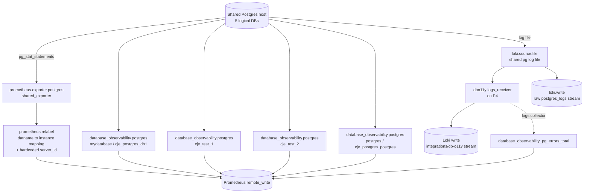

# dbo11y-feedback

- **Status:** completed
- **Created:** 2026-09-10T10:59:17.301Z
- **Link:** [Open in Grafana](https://somerfordcje.grafana.net/a/grafana-assistant-app/canvas/d4106726-3072-4d70-bc0e-7baccf9dbc96)

---

## Database Observability (dbo11y) — Fleet Alloy pipeline findings

Summary of issues found while rebuilding the Alloy/Fleet Management pipeline setup for a shared Postgres host with 5 logical databases (mydatabase, cje_test_1, cje_test_2, postgres, plus a disabled cje_test_3 test pipeline used purely for comparison). Grafana Cloud, Prometheus datasource grafanacloud-prom, Loki datasource grafanacloud-logs.

---

### Architecture built

One shared prometheus.exporter.postgres scrapes pg_stat_statements once for all 4 main databases (to avoid 4x duplicate scraping of a single connection's cluster-wide view), with a prometheus.relabel step mapping datname to the correct per-database instance label. Four separate database_observability.postgres pipelines (one per database) each hold their own DSN and collect query_details, query_samples, schema_details, and explain_plans. The 'postgres' pipeline additionally owns the loki.source.file reading the shared Postgres log file, fanned out to both the dbo11y logs_receiver (for structured processing) and loki.write (for raw log browsing).

**Pipeline architecture**



---

### Root causes found and fixed

| # | Issue | Root cause | Fix applied |
| --- | --- | --- | --- |
| 1 | pg_stat_statements scraped 4x | Each of 4 pipelines had its own prometheus.exporter.postgres against the same cluster-wide connection | Single shared exporter (16979) + prometheus.relabel mapping datname to per-DB instance |
| 2 | dsn label equalled instance label, breaking correlation | discovery.relabel rule order overwrote instance before dsn was captured from it | Reordered rules: capture dsn from instance first, then set job, then overwrite instance |
| 3 | query_samples / wait_events cross-contaminated between databases | pg_stat_activity is cluster-wide; without filtering, each pipeline saw all databases' activity | Added exclude_databases on 3 of 4 pipelines (mydatabase, cje_test_1, cje_test_2), excluding the other main DBs each |
| 4 | Query drill-down links did not resolve (no server_id) | database_observability.postgres normally injects server_id onto its own AND the pass-through exporter's targets via the targets wiring; splitting into a shared exporter severed that wiring, so pg_stat_statements never got server_id | Hardcoded the live server_id value into the shared exporter's prometheus.relabel block |
| 5 | explain_plan_output log fields inconsistent | Field named schema actually holds the database name (not a namespace/schema, unlike create_statement's schema field); field named digest instead of queryid used elsewhere | Not fixable from config — documented as a collector naming inconsistency |
| 6 | Errors under db-o11y monitoring user missing from pg_errors_total | Deliberately excluded by design (only db-user activity is counted) | Confirmed expected behaviour, no fix needed |
| 7 | server_id changes unexpectedly | Regenerates on pipeline/component recreation or full docker-compose restart (not on ordinary relabel edits) | Requires manual re-sync of the hardcoded server_id value in the shared exporter after any restart |
| 8 | Explain plans missing for some queries | Collector deliberately skips reserved-word / denylisted queries (processingResult: skipped) | Confirmed expected Postgres/collector behaviour |

---

### Confirmed issues — likely product bugs, not fixable from our config

| Issue | Evidence | Impact |
| --- | --- | --- |
| Per-query "Errors" panel always shows No Data | database_observability_pg_errors_total has labels datname, dsn, instance, job, server_id, severity, sqlstate, sqlstate_class, user — no queryid. Confirmed: same selector with queryid added returns zero results; without queryid it returns real data (23503 FK violation count 1035, 42P01 undefined-table count 11467) | Per-query error correlation is structurally impossible today. Any query detail page's Errors section will always read No Data, on any database, regardless of Alloy config |
| Query-detail page 'instance' filter chip shows wrong database instance | URL and every embedded panel query (rate, duration, rows, wait, explain) correctly scope by server_id+datname+queryid; the underlying pg_stat_statements series itself carries the correct instance (verified instance=cje_postgres_cje_test_2 for a cje_test_2 queryid); only the page's displayed instance label/filter chip was wrong (showed cje_postgres_cje_test_1) | Confusing/misleading UI for any server_id that legitimately maps to multiple instances (i.e. any multi-database host) — the label is likely resolved via a lookup scoped to server_id alone instead of joining on datname |
| query_samples / wait_events rarely populate under fast synthetic load | Only 1 op=query_sample log line captured across all pipelines in a 15-minute high-throughput test window; zero wait_event_type occurrences | Point-in-time pg_stat_activity sampling has a low probability of catching fast (sub-millisecond) queries or transient waits; this is a fundamental sampling-frequency limitation, not a config defect, but is worth surfacing as a known constraint |
| No query captured for statements that fail before planning | A query referencing a nonexistent object fails during parse/analyze, before pg_stat_statements instruments it — so no queryid, no plan, no stats, only a pg_errors_total-style error count | Expected Postgres behaviour, but non-obvious to a user expecting every error to trace back to a queryid |

---

### Evidence

Live query results captured during this investigation, supporting the two headline findings above.

**Error metric filtered by datname only (should show data)**

```json
{
  "panelId": "p86",
  "timeRange": {
    "from": "2026-09-10T21:58:51.403Z",
    "to": "2026-09-10T21:58:51.403Z"
  },
  "targets": [
    {
      "app": "grafana-assistant-app",
      "datasource": {
        "uid": "grafanacloud-prom"
      },
      "expr": "database_observability_pg_errors_total{server_id=\"02e98073675924d859adcfb067bae59ea90668a311982179618bfa6e226f1d3a\", datname=\"cje_test_1\"}",
      "format": "table",
      "instant": true,
      "legendFormat": "",
      "range": false,
      "refId": "A"
    }
  ]
}
```

Above: same selector (server_id + datname=cje_test_1) with queryid added returns zero data; without queryid it returns real error counts by sqlstate. This is the direct proof that database_observability_pg_errors_total has no queryid label.

**Instance label for cje_test_2 queryid series**

```json
{
  "panelId": "p75",
  "timeRange": {
    "from": "2026-09-10T21:14:00.058Z",
    "to": "2026-09-10T21:14:00.058Z"
  },
  "targets": [
    {
      "app": "grafana-assistant-app",
      "datasource": {
        "uid": "grafanacloud-prom"
      },
      "expr": "pg_stat_statements_calls_total{server_id=\"02e98073675924d859adcfb067bae59ea90668a311982179618bfa6e226f1d3a\", datname=\"cje_test_2\", queryid=\"-4069889860013603831\"}",
      "format": "table",
      "instant": true,
      "legendFormat": "",
      "range": false,
      "refId": "A"
    }
  ]
}
```

---

### Asks for the product team

1. Add a queryid label to database_observability_pg_errors_total (correlate via backend pid/timestamp against query_sample data) so the per-query Errors panel can actually function.

2. Fix the query-detail page's instance filter/label resolution to join on datname (or server_id+datname+queryid) instead of resolving instance from server_id alone — needed for any multi-database host.

3. Document the targets-wiring dependency between database_observability.postgres and its paired prometheus.exporter.postgres — specifically that server_id is injected via that wiring, so any architecture that decouples the exporter (e.g. to deduplicate cluster-wide scrapes across multiple logical databases) silently loses server_id on the shared metric.

4. Provide an official pattern for scraping pg_stat_statements once per host when observing several logical databases on the same Postgres instance, instead of once per database_observability.postgres pipeline — today this requires a hand-built shared exporter plus manual server_id and datname-to-instance relabeling that breaks on every restart.

5. Align field naming in explain_plan_output logs with the rest of the collector (schema currently holds the database name here, unlike create_statement's schema which is a true namespace; digest should be renamed queryid for consistency).

---

_All findings above were reproduced live against Grafana Cloud Prometheus/Loki during this session and are not theoretical._